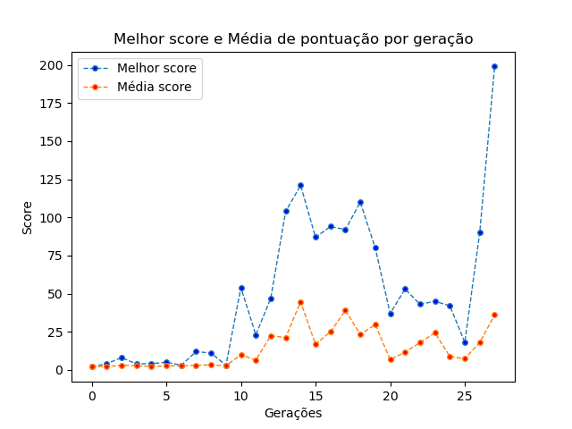

# Dino evolutivo

Esse projeto é um algoritmo evolutivo para o famoso jogo do dinossauro do google.

# Vídeo

Video explicando o código e com desmonstração do funcionamento:

https://youtu.be/z6_aRjZORBc

# Código

O código possui 3 modos de jogo:

## Simulation

No modo simulation são gerados por default 10 dinos, mas o usuário pode alterar o número da população, esses 10 dinos possuem brains aleatórios então cada dinossauro começará com uma ação diferente, é selecionado o melhor dinossauro da geração e é feito crossover do melhor dino com o restante da população e mutação dos mesmos  

```bash
python3 main.py simulation 
```

para definir o tamanho da população:

```bash
python3 main.py simulation 15
```

## Train

No modo train são gerados por default 10 dinos, mas o usuário pode alterar o número da população, para cada dino da população é carregado o melhor dino já obtido em todas as vezes que o train já foi rodado e é feito uma mutação de toda a população, exceto de 1 para que este mantenha o brain do melhor dino já treinado até então, ao final de cada geração é feito crossover do melhor dino com o restante da população e mutação dos mesmos e o brain do melhor dino é salvo data/brain

```bash
python3 main.py train 
```

para definir o tamanho da população:

```bash
python3 main.py train 15
```

## Game

No modo game o usuário disputa com o melhor dino já treinado, o usuário é o dino preto e o melhor dino é o dino vermelho

```bash
sudo python3 main.py game 
```

é preciso de rodar com o sudo para ler a input do teclado.

## Gráfico de Melhor Score x Média dos Scores da população

```bash
python3 graph.py 
```

Neste gráfico observamos que a partir da 10ª geração ele tem um score expressivo que representa um usuário jogando, por 5 minutos, por exemplo, verificado por teste enquanto eu jogava. A partir já da 15ª geração começa a atingir scores na faixa de 125 que é próximo a velocidade máxima que o dino alcança, o que significa que ele já aprendeu como passar por todas as fases do jogo, tendo algumas perdas para sair dos mínimos locais de comportamento que ele estava tendo e a partir da 26ª geração ele já alcança pontuações bem altas, tendo aprendido o jogo em aproximadamente 10 minutos, com 10 dinos por geração.




